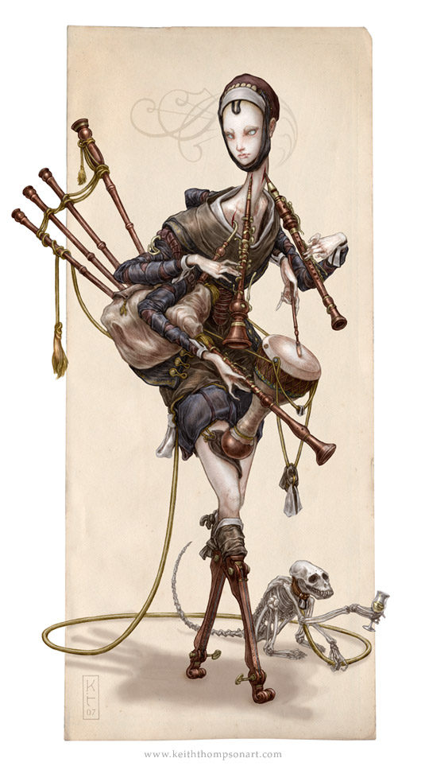

Her body appears and you look in shock. She holds clarnets in her hands, but some clarnets are penetrated in her throat. She has a long neck, so long that she isn’t human.  Her legs are actual necks of violins. **Do you attack or run away?**

  
`credit: "COBBLED SKALD" by Keith Thompson`

### [Attack!](attack.md)
### [Run!](continue-running.md)