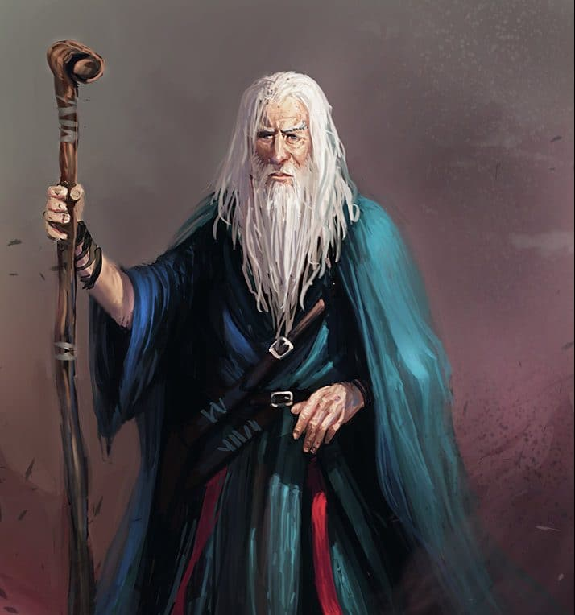

You've encountered an old man with a long staff. **What do you do?**

`credit: mago Tuttoesubito from federicocasini.com`

### [Run and attack him!](spell.md)  
### [Calmly walk towards him](follow.md)